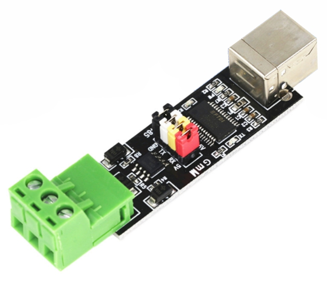

# homeassistant
Instructions and Customizations for Home Assistant

This repository is a placeholder for setting up and configuring all the random customization

When using VSCode for the first time, you will need to configure your username and email with the help of the following commands.
```
git config -global user.email "you@example.com"
git config -global user.name "Your Name"
```

After configuring your details, you can confirm that they are applied by using the following command
```
git config -global -list
```

## Preferences
This setup consists of a physical computer, running Proxmox with Home Assistant installed using a helper script from: https://tteck.github.io/Proxmox/

## Equipment
For the integration between Home Assistant and a 8KW Sunsynk Hybrid Inverter, I have successfully tested and am currently using the following RS485 to USB converter from a local supplier
- https://www.mantech.co.za/ProductInfo.aspx?Item=15M5345 

## Home Assistant
You will need to install an add-on repository which provides all necessary to get started with the Sunsynk inverter
1. Navigate to Settings > Add-ons > Add-on store > Menu > Repositories
2. Add https://github.com/kellerza/sunsynk
3. In the Add-on store, Install Sunsynk/Deye Inverter Add-on (multi)
4. Once installed you will need to edit the Configuration using similar settings
    ```
    - SERIAL_NR: "22X1X2X3X4"
    HA_PREFIX: SS
    MODBUS_ID: 1
    PORT: /dev/serial/by-id/usb-FTDI_FT232R_USB_UART_A50285BI-if00-port0
    ```
5. You will need to configure your MQTT connection settings and confirm that the Username and Password are working correcting by reviewing the Log tab

Once you have done all of the above, you can use MQTT Explorer where you can confirm the inverter is communicating correctly and sending data through to the MQTT broker

### Reference
https://github.com/kellerza/sunsynk
